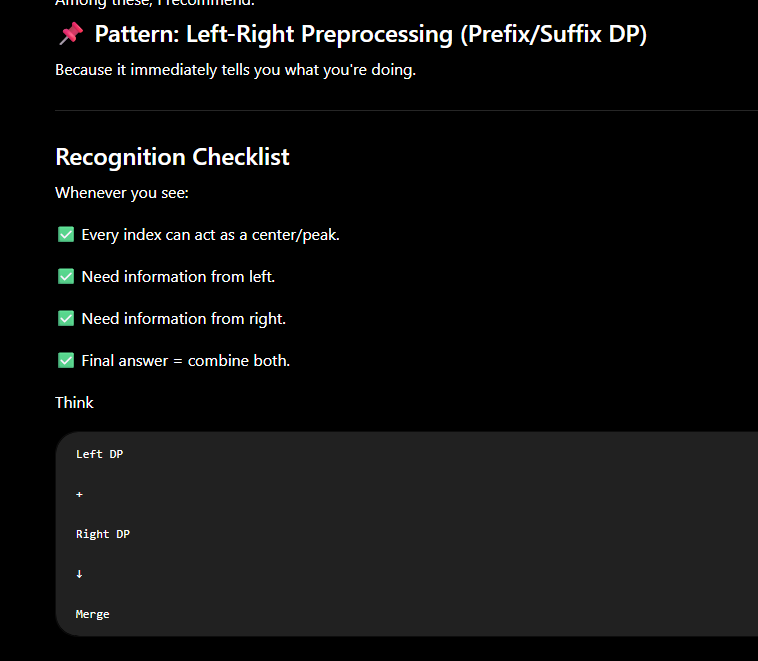
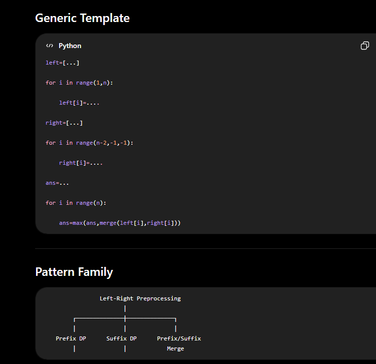
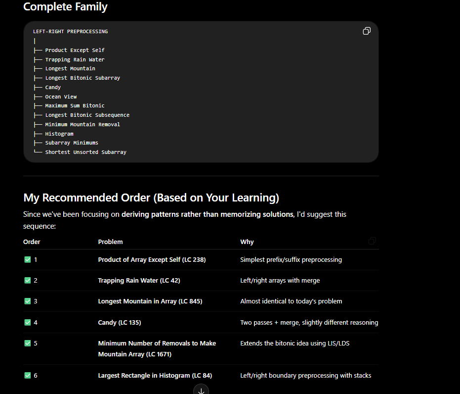

# 📘 Longest Bitonic Subarray (GFG)

> **Pattern:** Left-to-Right + Right-to-Left Preprocessing (Prefix/Suffix DP)
>
> **Difficulty:** Medium
>
> **Time:** O(n)
>
> **Space:** O(n)

---

# Problem

Given an array, find the **maximum length of a contiguous bitonic subarray**.

A bitonic subarray first **non-decreasing** (`<=`) and then **non-increasing** (`>=`).

```
Increase → Peak → Decrease
```

Example

```text
arr = [12,4,78,90,45,23]

Output = 5

Bitonic Subarray

4 → 78 → 90 → 45 → 23
```

---

# Brute Force

Generate every subarray.

For each subarray,

- check if increasing
- after first decrease, it should never increase again.

```python
for every i
    for every j
        if bitonic(arr[i:j]):
            answer=max(answer,length)
```

### Time

```
O(n²) subarrays

×

O(n) verification

=

O(n³)
```

---

# Observation

Instead of checking every subarray,

Suppose every element is the **peak**.

```
4 78 90 45 23
      ↑
```

If we already know

- increasing length ending at 90
- decreasing length starting at 90

then we instantly know the bitonic length.

---

# Main Idea

Break one difficult problem into two simple problems.

Instead of finding

```
Longest Bitonic Subarray
```

Find

```
1. Increasing information from Left

2. Decreasing information from Right
```

Then combine.

---

# Understanding inc[]

## Definition

```
inc[i]

=

Length of longest contiguous NON-DECREASING
subarray ending at index i.
```

**Keyword**

> **ENDING at i**

Every index asks

> "If I must stop here, how long have I been increasing?"

---

Example

```text
arr = [12,4,78,90,45,23]

Index : 0 1 2 3 4 5
Value :12 4 78 90 45 23
```

---

## Index 0

```
12

Length =1
```

```
inc[0]=1
```

---

## Index1

Check

```
12<=4 ?

No
```

Chain breaks.

```
4

Length=1
```

```
inc[1]=1
```

---

## Index2

Check

```
4<=78

Yes
```

Extend previous chain.

Previous

```
inc[1]=1
```

Now

```
4 78

Length=2
```

```
inc[2]=2
```

---

## Index3

Check

```
78<=90

Yes
```

Extend.

```
4 78 90

Length=3
```

```
inc[3]=3
```

---

## Index4

```
90<=45 ?

No
```

Restart.

```
45

Length=1
```

---

## Index5

```
45<=23 ?

No
```

Restart.

```
23

Length=1
```

Final

```text
inc=[1,1,2,3,1,1]
```

---

# Why does inc[3]=3 mean [4,78,90]?

`inc[3]=3` means

```
A chain of length 3
ENDS at index 3.
```

Index3 is

```
90
```

Length =3

Start index

```
start=i-length+1

=3-3+1

=1
```

Subarray

```
arr[1...3]

=

4 78 90
```

**General Formula**

```
If

inc[i]=L

then

start=i-L+1

Subarray

arr[start...i]
```

---

# Understanding dec[]

Definition

```
dec[i]

=

Length of longest contiguous NON-INCREASING
subarray STARTING at i.
```

Keyword

> **STARTING at i**

Every index asks

> "If I start here, how long can I keep decreasing?"

---

Build from RIGHT.

Example

```
23

Length=1
```

```
dec[5]=1
```

---

45

```
45>=23

Yes
```

```
45 23

Length=2
```

```
dec[4]=2
```

---

90

```
90>=45

Yes
```

```
90 45 23

Length=3
```

```
dec[3]=3
```

---

78

```
78>=90 ?

No
```

Restart.

```
78

Length=1
```

---

4

```
4>=78 ?

No
```

Restart.

---

12

```
12>=4

Yes
```

```
12 4

Length=2
```

Final

```text
dec=[2,1,1,3,2,1]
```

---

# Peak Combination

Peak

```
90
```

Increasing part

```
4 78 90

Length=3
```

Decreasing

```
90 45 23

Length=3
```

If we add

```
3+3=6
```

Wrong.

Because

```
90
```

is counted twice.

Correct

```
3+3-1=5
```

Hence

```
bitonic(i)=inc[i]+dec[i]-1
```

Take maximum over every index.

---

# Why subtract 1?

Because

```
Increasing Part

4 78 90
      ↑

Decreasing Part

90 45 23
↑
```

Peak belongs to both.

So

```
Total

=

inc

+

dec

-

1
```

---

# Dry Run

```text
arr

12 4 78 90 45 23

inc

1 1 2 3 1 1

dec

2 1 1 3 2 1
```

Now

|Index|Peak|inc|dec|Bitonic|
|------|----|---|---|--------|
|0|12|1|2|2|
|1|4|1|1|1|
|2|78|2|1|2|
|3|90|3|3|5|
|4|45|1|2|2|
|5|23|1|1|1|

Maximum

```
5
```

---

# Building the Code

## Step1

Initialize

```python
inc=[1]*n
```

Every element itself is an increasing subarray.

---

## Step2

Move Left → Right

```python
for i in range(1,n):
```

If

```python
arr[i]>=arr[i-1]
```

Extend previous chain.

```python
inc[i]=inc[i-1]+1
```

Else

Do nothing.

Already initialized to 1.

---

## Step3

Initialize

```python
dec=[1]*n
```

---

## Step4

Move Right → Left

```python
for i in range(n-2,-1,-1):
```

If

```python
arr[i]>=arr[i+1]
```

Extend.

```python
dec[i]=dec[i+1]+1
```

---

## Step5

Every index is peak.

```python
ans=1

for i in range(n):

    ans=max(ans,inc[i]+dec[i]-1)
```

---

# Complete Code

```python
def longestBitonicSubarray(arr):

    n=len(arr)

    inc=[1]*n

    for i in range(1,n):

        if arr[i]>=arr[i-1]:
            inc[i]=inc[i-1]+1

    dec=[1]*n

    for i in range(n-2,-1,-1):

        if arr[i]>=arr[i+1]:
            dec[i]=dec[i+1]+1

    ans=1

    for i in range(n):

        ans=max(ans,inc[i]+dec[i]-1)

    return ans
```

---

# How to Decide Loop Direction

This is one of the most useful interview rules.

## Rule 1

If recurrence depends on

```
i-1
```

Move

```
Left → Right
```

Template

```python
for i in range(1,n):
```

Examples

```python
inc[i]=inc[i-1]+1

prefixSum[i]=prefixSum[i-1]+arr[i]

leftMax[i]=max(leftMax[i-1],arr[i])
```

---

## Rule 2

If recurrence depends on

```
i+1
```

Move

```
Right → Left
```

Template

```python
for i in range(n-2,-1,-1):
```

Examples

```python
dec[i]=dec[i+1]+1

suffixSum[i]=suffixSum[i+1]+arr[i]

rightMax[i]=max(rightMax[i+1],arr[i])
```

---

# Golden DP Traversal Rule

```
Need i-1 ?

↓

Move Forward


Need i+1 ?

↓

Move Backward
```

Never memorize loops.

Remember dependency.

---

# Pattern Recognition

Whenever a problem asks

```
Best answer centered around an index
```

Think

```
Can I compute

Left Information

+

Right Information

and merge?
```

---

# Similar Problems

### Prefix/Suffix Pattern

- Product of Array Except Self
- Trapping Rain Water
- Longest Mountain in Array
- Candy Distribution
- Prefix Maximum
- Suffix Maximum

---

### DP Direction Pattern

- House Robber
- Maximum Sum Increasing Subsequence
- LIS
- Bitonic Sequence
- Longest Mountain
- Prefix/Suffix DP

---

# Real World Analogy

Imagine a mountain.

```
        Peak
         ▲
       /   \
      /     \
```

Left side

```
How far can I climb?
```

Right side

```
How far can I descend?
```

Mountain Length

```
Left

+

Right

-

Peak
```

---

# Interview Thought Process

Never think

```
Find longest bitonic.
```

Instead think

```
Can every index be the peak?

↓

Can I preprocess information from left?

↓

Can I preprocess information from right?

↓

Can I merge?
```

---

# Reusable Pattern Template

```
Question asks

↓

Longest/Best centered at every index

↓

Precompute Left Information

↓

Precompute Right Information

↓

Merge at every index

↓

Take maximum
```

---

# Cheat Sheet

```
inc[i]

=

Longest increasing chain ending at i


dec[i]

=

Longest decreasing chain starting at i


Bitonic

=

inc[i]+dec[i]-1


Need i-1

↓

Move Left→Right


Need i+1

↓

Move Right→Left


Peak counted twice

↓

Subtract 1


Time

O(n)

Space

O(n)
```

---

# Biggest Lesson Learned Today ⭐

**Don't solve the original difficult problem directly.**

Instead:

1. Break it into simpler directional subproblems.
2. Precompute reusable information.
3. Merge the results.

This "Left Information + Right Information + Merge" strategy appears in dozens of interview problems and is one of the most important array preprocessing patterns to master.





